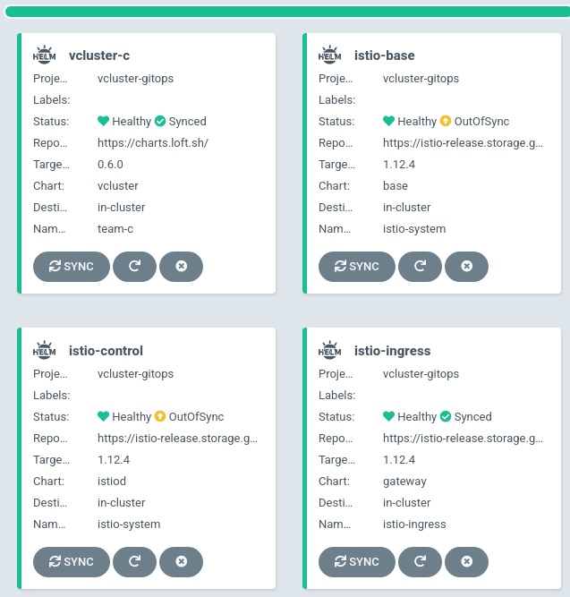

# ArgoCD Deployment

## Requirements

* Kubernetes Cluster (K3d/Kind/K3s/K8s/AKS/GKE/EKS)
* Vcluster binnary installed (accessing cluster test)
* ArgoCD installed and configured within Kubernetes if not try [this](./ARGOCD-INSTALL.md)
* Istio installed and configured (ArgoCD approaches)

## Applying manifests
2 available options:

### Prequisite
Create project
```bash
kubectl apply -f manifests/argocd/projects/project.yaml
```

### Clusterip
```bash
kubectl apply -f manifests/argocd/vcluster/k3s/vcluster-clip.yaml
```

### Loadbalancer
```console
kubectl apply -f manifests/argocd/vcluster/k3s/vcluster-lb.yaml
```

#### Accessing cluster
```console
export LB_IP=$(kubectl get svc -n istio-ingress -o jsonpath='{$.items[*].status.loadBalancer.ingress[0].ip}')
vcluster connect vcluster -n team-b --server=https://$LB_IP --kube-config=./kubeconfig-vcluster-test1.yaml
```


### Ingress (Istio)
Istio manifests should be applied first

```console
kubectl apply -f manifests/istio
```
Then applied ArgoCD project & application:

```console
kubectl apply -f manifests/istio
kubectl apply -f manifests/argocd/vcluster/k3s/vcluster-ing.yaml
```

`Important`

Below values need to be provided!
```yaml
- name: syncer.extraArgs
  value: '{--tls-san=vcluster.team-c.172.18.0.3.nip.io}'
```
For testing please make sure that you have 172.18.0.3 assigned to one of k3d nodes, otherwise you will be not able connect to.


Otherwise you got an error:

```
Unable to connect to the server: x509: certificate is valid for kubernetes.default.svc.cluster.local, kubernetes.default.svc, kubernetes.default, kubernetes, localhost, not vcluster.team-c.172.18.0.5.nip.io
```

Solution 
Avoiding extra efforts can be static configuration for K3D cluster:

**k3d/config.yaml**
```yaml
subnet: "172.18.0.0/16"
```

ArgoCD application list:


#### Accessing cluster 

```console
mkdir tmp
export INGRESS=$(kubectl get nodes --selector=node-role.kubernetes.io/master -o jsonpath='{$.items[*].status.addresses[?(@.type=="InternalIP")].address}')
vcluster connect vcluster -n team-c --server=https://vcluster.team-c.$INGRESS.nip.io --kube-config=./tmp/vcluster-kubeconfig-team-c.yaml
```

**Output:**
```console
[info]   Use `vcluster connect vcluster -n vcluster -- kubectl get ns` to execute a command directly within this terminal
[done] √ Virtual cluster kube config written to: ./kubeconfig.yaml. You can access the cluster via `kubectl --kubeconfig ./kubeconfig.yaml get namespaces`
```

Output may be different it depend on your configuration

```console
kubectl get no --kubeconfig=./tmp/vcluster-kubeconfig-team-c.yaml -o wide
NAME                         STATUS   ROLES    AGE   VERSION        INTERNAL-IP    EXTERNAL-IP   OS-IMAGE                KERNEL-VERSION      CONTAINER-RUNTIME
k3d-vcluster-demo-server-0   Ready    <none>   60m   v1.23.3+k3s1   10.43.110.80   <none>        Fake Kubernetes Image   4.19.76-fakelinux   docker://19.3.12
```

Alternatively kubectl instead of vcluster
```console
kubectl get secret -n team-c vc-vcluster-a -o jsonpath='{.data.config}' | base64 -d | sed 's/^\([[:space:]]\+server:\).*/\1 https:\/\/vcluster-a.team-c.'"$INGRESS"'.nip.io/' > ./tmp/vcluster-a-kubeconfig-team-c.yaml
kubectl get secret -n team-c vc-vcluster-b -o jsonpath='{.data.config}' | base64 -d | sed 's/^\([[:space:]]\+server:\).*/\1 https:\/\/vcluster-b.team-c.'"$INGRESS"'.nip.io/' > ./tmp/vcluster-b-kubeconfig-team-c.yaml
```
