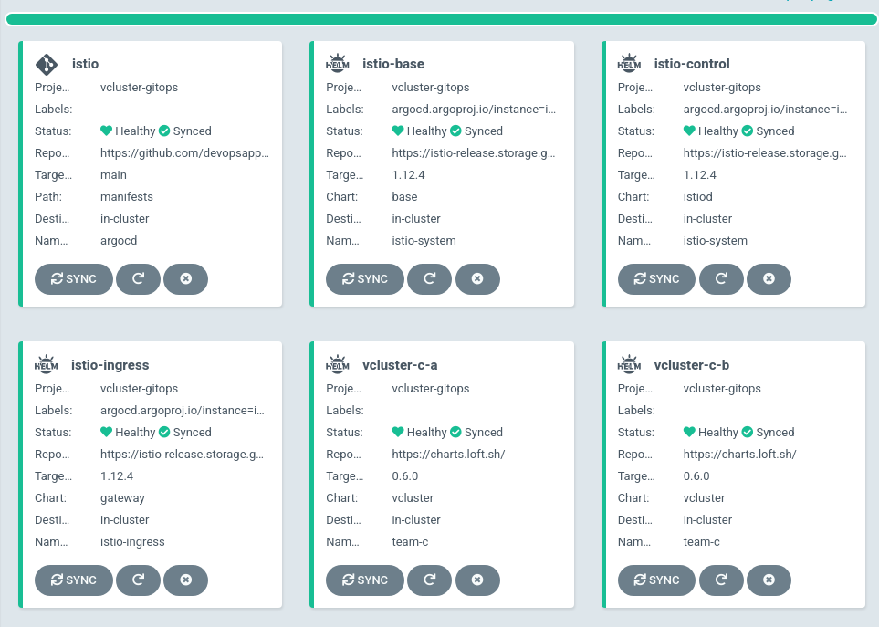

# Multiple vcluster on on real cluster

## Mission
Build in cheap way as much as need

Porpose:


# ArgoCD Deployment

## Requirements

* Kubernetes Cluster (K3d/Kind/K3s/K8s/AKS/GKE/EKS)
* ArgoCD installed and configured within Kubernetes if not try [this](./ARGOCD-INSTALL.md)
* Istio installed and configured (ArgoCD approaches)

## Applying manifests
- [X] install 
- [X] istio gateway & virtual service
- [X] vcluster-a/vcluster-b

### Prequisite
Create project
```console
kubectl apply -f manifests/argocd/common/project.yaml
```

### Istio base, istiod, istio ingress
Istio manifests should be applied first (Apps of apps & sync wave under construction!)

```console
kubectl apply -f manifests/istio/istio.yaml
```
Then applied ArgoCD project & application:

```console
kubectl apply -f manifests/istio/vcluster-gateway.yaml
kubectl apply -f manifests/argocd/vcluster/k3s/vcluster-a-ing.yaml
kubectl apply -f manifests/argocd/vcluster/k3s/vcluster-b-ing.yaml
kubectl apply -f manifests/istio/vcluster-vs-ab.yaml
```
ArgoCD application list:


#### Accessing cluster 
Alternatively kubectl instead of vcluster

```console
mkdir -p tmp/
kubectl get secret -n team-c vc-vcluster-a -o jsonpath='{.data.config}' | base64 -d | sed 's/^\([[:space:]]\+server:\).*/\1 https:\/\/vcluster-a.team-c.'"$INGRESS"'.nip.io/' > ./tmp/vcluster-a-kubeconfig-team-c.yaml
kubectl get secret -n team-c vc-vcluster-b -o jsonpath='{.data.config}' | base64 -d | sed 's/^\([[:space:]]\+server:\).*/\1 https:\/\/vcluster-b.team-c.'"$INGRESS"'.nip.io/' > ./tmp/vcluster-b-kubeconfig-team-c.yaml
```

**Export ingress var:**
```console
export INGRESS=$(kubectl get nodes --selector=node-role.kubernetes.io/master -o jsonpath='{$.items[*].status.addresses[?(@.type=="InternalIP")].address}')
```

**vcluster-a**
Read values to get more details about vcluster-a characteristic
```console
kubectl get no --kubeconfig=./tmp/vcluster-a-kubeconfig-team-c.yaml
NAME                         STATUS   ROLES    AGE     VERSION
k3d-vcluster-demo-server-0   Ready    <none>   3m19s   v1.20.2+k3s1
```

More details about syncing an be find [here](https://www.vcluster.com/docs/architecture/nodes)

**vcluster-b**
Read values to get more details about vcluster-b characteristic
```console
kubectl get no --kubeconfig=./tmp/vcluster-b-kubeconfig-team-c.yaml
NAME                        STATUS   ROLES    AGE   VERSION
NAME                         STATUS   ROLES                  AGE     VERSION
k3d-vcluster-demo-server-0   Ready    control-plane,master   4m10s   v1.22.6+k3s1
k3d-vcluster-demo-agent-1    Ready    <none>                 4m10s   v1.22.6+k3s1
k3d-vcluster-demo-agent-0    Ready    <none>                 4m10s   v1.22.6+k3s1
```

### ArgoCD installation aross vlusters
Have look into below links:<br/>
[vluster-a](./ARGOCD-INSTALL.md####vcluster-a)<br/>
[vluster-b](./ARGOCD-INSTALL.md####vcluster-b)
