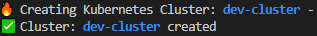

### Deploy K3d cluster using config file
```
./utins/create-k3d-cluster.sh
```


***example output:***




`Be aware` 
<br/>Some changes in k3d may become k3d/dev-cluster.conf incompatible.
It requires some additional steps to be migrated.

```console
k3d migrate config.yaml > config-migrated.yaml
mv config-migrated.yaml config.yaml
```
