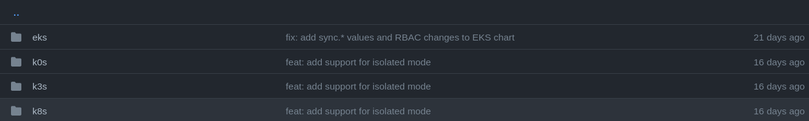

# ArgoCD Deployment

## Requirements

* Kubernetes Cluster (K3d/Kind/K3s/K8s/AKS/GKE/EKS)
* ArgoCD installed and configured within Kubernetes if not try [this](./ARGOCD-INSTALL.md)
* Istio installed and configured (ArgoCD approaches)

### Legend
Each cluster has been created in separate namespace and by ArgoCD deployment


| num | vcluster name | namespace | exposed by | distro | description                                               | HA mode |
|-----|:--------------|:----------|:-----------|:-------|:----------------------------------------------------------|:--------|
| 1   | vcluster-e    | team-e    | istio      | EKS    | EKS cluster running based AWS Kuberentes images           | False   |
| 2   | vcluster-f    | team-f    | istio      | K0S    | K0S cluster with all features needed to run kubernetes    | False   |
| 3   | vcluster-g    | team-g    | istio      | K8S    | K8S dustribution it simmilar to kubeadm deploy kubernetes | False   |


### Helmchart list:
https://github.com/loft-sh/vcluster/tree/main/charts



### Warning
Be aware about default values and adjust serviceCIDR corresponds to your Cluster!
I encountered an [issue](./VARIETY-OF-DISTROS.md####Issue) within K0S cause it used 10.96.0.0/12!

### EKS

```
export INGRESS=$(kubectl get nodes --selector=node-role.kubernetes.io/master -o jsonpath='{$.items[*].status.addresses[?(@.type=="InternalIP")].address}')

kubectl apply -f manifests/argocd/vcluster/eks

kubectl get secret -n team-e vc-vcluster-e -o jsonpath='{.data.config}' | base64 -d | sed 's/^\([[:space:]]\+server:\).*/\1 https:\/\/vcluster-e.team-e.'"$INGRESS"'.nip.io/' > ./tmp/vcluster-e-kubeconfig-team-e.yaml
```

**status:**

vcluster:
```
$ kubectl get nodes --kubeconfig=./tmp/vcluster-e-kubeconfig-team-e.yaml 
NAME                        STATUS   ROLES    AGE   VERSION
k3d-vcluster-demo-agent-1   Ready    <none>   51m   v1.21.5-eks-1-21
```

host cluster:
```
kubectl get po -n team-e
NAME                                                  READY   STATUS    RESTARTS      AGE
vcluster-e-etcd-0                                     1/1     Running   0             78m
vcluster-e-api-86d976c8f-rfpjs                        1/1     Running   1 (76m ago)   78m
vcluster-e-9bb754d4f-hbv6w                            1/1     Running   2 (76m ago)   78m
vcluster-e-controller-67676587d9-slwsm                1/1     Running   2 (76m ago)   78m
coredns-6c88775df8-bmnqp-x-kube-system-x-vcluster-e   1/1     Running   0             76m
```

---

### K0s
```
export INGRESS=$(kubectl get nodes --selector=node-role.kubernetes.io/master -o jsonpath='{$.items[*].status.addresses[?(@.type=="InternalIP")].address}')

kubectl apply -f manifests/argocd/vcluster/k0s

kubectl get secret -n team-f vc-vcluster-f -o jsonpath='{.data.config}' | base64 -d | sed 's/^\([[:space:]]\+server:\).*/\1 https:\/\/vcluster-f.team-f.'"$INGRESS"'.nip.io/' > ./tmp/vcluster-f-kubeconfig-team-f.yaml
```

status:
TBD cause crashes
```
$ kubectl get po -n team-f
NAME           READY   STATUS             RESTARTS      AGE
vcluster-f-0   1/2     CrashLoopBackOff   5 (50s ago)   5m19s
```

#### Issue
The main reason of crash was:

```
I0310 10:19:18.897321       1 start.go:340] CoreDNS configuration from the manifest file applied successfully
F0310 10:19:18.903964       1 main.go:32] start controllers: sync kubernetes service: sync kubernetes service: Service "kubernetes" is invalid: spec.clusterIPs: Invalid value: []string{"10.43.58.69"}: failed to allocate IP 10.43.58.69: provided IP is not in the valid range. The range of valid IPs is 10.96.0.0/12
```

`It means that default serviceCIDR provided by helm values is 10.96.0.0/12 therefore should be 10.43.0.0/12 cause vcluster
was deployed on k3d!`

---

### K8s
Multiple api/etcd/controllers

```
export INGRESS=$(kubectl get nodes --selector=node-role.kubernetes.io/master -o jsonpath='{$.items[*].status.addresses[?(@.type=="InternalIP")].address}')

kubectl apply -f manifests/argocd/vcluster/k8s

kubectl get secret -n team-g vc-vcluster-g -o jsonpath='{.data.config}' | base64 -d | sed 's/^\([[:space:]]\+server:\).*/\1 https:\/\/vcluster-g.team-g.'"$INGRESS"'.nip.io/' > ./tmp/vcluster-g-kubeconfig-team-g.yaml
```

**status:**

vcluster
```
$ kubectl get no --kubeconfig=./tmp/vcluster-g-kubeconfig-team-g.yaml  
NAME                        STATUS   ROLES    AGE     VERSION
k3d-vcluster-demo-agent-1   Ready    <none>   2m47s   v1.23.1
```

host cluster:
```
$ kubectl get po -n team-g 
NAME                                                  READY   STATUS    RESTARTS      AGE
vcluster-g-etcd-0                                     1/1     Running   0             15h
vcluster-g-api-749f749df6-cp7tc                       1/1     Running   1 (15h ago)   15h
coredns-687874b9dd-q7cfq-x-kube-system-x-vcluster-g   1/1     Running   0             15h
vcluster-g-67fbd76597-s7qcq                           1/1     Running   0             5m33s
vcluster-g-controller-55db6f4cf6-5ct45                1/1     Running   0             5m29s
vcluster-g-api-749f749df6-9nvnw                       1/1     Running   0             5m33s
vcluster-g-controller-55db6f4cf6-jhcpz                1/1     Running   0             5m2s
vcluster-g-api-749f749df6-77jff                       1/1     Running   0             5m33s
vcluster-g-controller-55db6f4cf6-pldr8                1/1     Running   0             5m33s
vcluster-g-etcd-1                                     0/1     Running   0             5m33s
vcluster-g-etcd-2                                     0/1     Running   0             5m32s
```