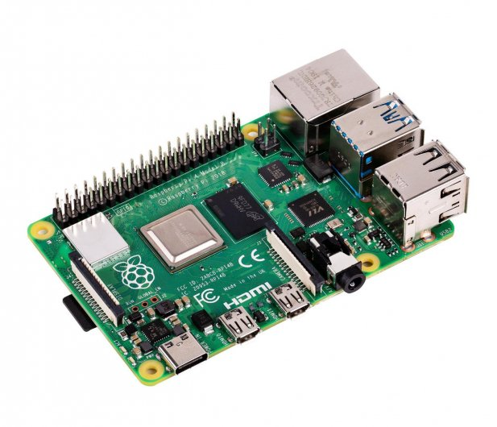

# Running Vcluster on ARM64 platform
From far time ago many companies started explore ARM64 platform.
Those are small computers that are ideal for IoT. Here I will demonstrate
How to spin up Vcluster on such as platform.  

How looks Rasberry pi4b here is a picture ;-)


## Requirements
- [X] vcluster-demo cloned
- [X] Rasberry Pi 4b or latest
- [X] k3s/k3d cluster (I will use k3s installed on phisical rasberry pi systems)
- [X] kubectl installed (binaries for arm64!)
- [X] helm commandline installed (binarios for arm64!)
- [X] vcluser commandline installed (binaries for arm64!)

## Identity platform
```console
$ kubectl get no -o wide
NAME        STATUS   ROLES                  AGE   VERSION        INTERNAL-IP    EXTERNAL-IP   OS-IMAGE                           KERNEL-VERSION     CONTAINER-RUNTIME
kube-st04   Ready    <none>                 23h   v1.23.6+k3s1   192.168.0.33   <none>        Rocky Linux 8.5 (Green Obsidian)   5.10.78-v8.1.el8   containerd://1.5.11-k3s2
kube-st03   Ready    <none>                 23h   v1.23.6+k3s1   192.168.0.32   <none>        Rocky Linux 8.5 (Green Obsidian)   5.10.78-v8.1.el8   containerd://1.5.11-k3s2
kube-st01   Ready    control-plane,master   23h   v1.23.6+k3s1   192.168.0.30   <none>        Rocky Linux 8.5 (Green Obsidian)   5.10.78-v8.1.el8   containerd://1.5.11-k3s2
kube-st02   Ready    <none>                 23h   v1.23.6+k3s1   192.168.0.31   <none>        Rocky Linux 8.5 (Green Obsidian)   5.10.78-v8.1.el8   containerd://1.5.11-k3s2
```

Your output should looks similarly.

```console
$ uname -a
Linux kube-st01 5.10.78-v8.1.el8 #1 SMP PREEMPT Wed Nov 10 14:40:33 UTC 2021 aarch64 aarch64 aarch64 GNU/Linux
$ lscpu
Architecture:        aarch64
Byte Order:          Little Endian
CPU(s):              4
On-line CPU(s) list: 0-3
Thread(s) per core:  1
Core(s) per cluster: 4
Socket(s):           -
Cluster(s):          1
Vendor ID:           ARM
Model:               3
Model name:          Cortex-A72
Stepping:            r0p3
CPU max MHz:         1500.0000
CPU min MHz:         600.0000
BogoMIPS:            108.00
Flags:               fp asimd evtstrm crc32 cpuid
```

## Installation
After making sure that you on proper cluster please do so:

### Check current context
```console
$ kubectl config current-context 
k3s-pi4
```

### Install vcluster by helm command
```console
helm repo add vcluster https://charts.loft.sh/
helm repo update vcluster
helm install dev vcluster/vcluster -n vcluster-rpi --create-namespace -f ./defaults/values-k3s.yaml --set service.type="ClusterIP"
```
:mag: Cause my cluster has no LoadBalancer so far I will use ClusterIP type service!

### Verification
```console
$ helm list -n vcluster-rpi
NAME    NAMESPACE       REVISION        UPDATED                                 STATUS          CHART           APP VERSION
dev     vcluster-rpi    1               2022-06-07 09:17:03.293693444 +0000 UTC deployed        vcluster-0.9.0
```

```console
$ vcluster list

 NAME   NAMESPACE      STATUS    CREATED                         AGE    
 dev    vcluster-rpi   Running   2022-06-07 09:17:04 +0000 UTC   3m23s  
```

### Connect cluster
Due to fact that I have no Loadbalancer in my K3s cluster, underneath we have kubectl + proxy combination

**List nodes**
```console
$ vcluster connect dev -n vcluster-rpi kubectl get no
NAME        STATUS   ROLES    AGE     VERSION
kube-st02   Ready    <none>   2m44s   v1.23.3+k3s1
```

